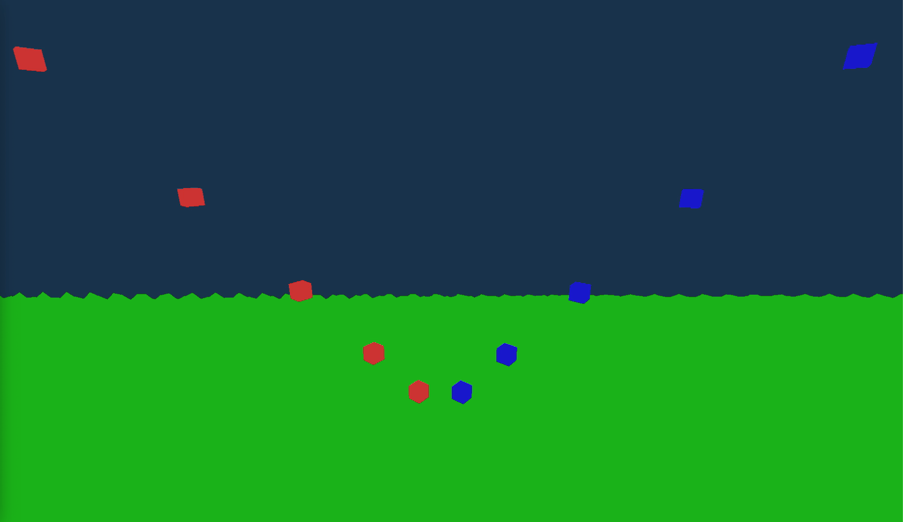

# Game Engine 72

A 3D game engine built from scratch in C++ and OpenGL as a learning project.

The goal is to understand how the systems inside a game engine work by implementing them step by step.

## Demo

[](./demo.mp4)(https://github.com/user-attachments/assets/d04b2684-c26e-44c0-9d30-0ce06ee7c3e0)

## Current Features

* Custom `Vec3` and `Mat4` math
* OpenGL window and rendering
* Shader compilation and uniforms
* Mesh rendering with VAO, VBO and EBO
* Perspective projection
* 3D camera
* WASD movement
* Mouse look and mouse capture
* Basic physics system
* Procedural terrain generation
* Terrain height variation
* Multiple mesh instances
* Model, view and projection transformations
* Rotating cube instances
* Basic colored rendering

## Build

```sh
make
```

## Run

```sh
make run
```

## What's Next

* Surface normals
* Lighting
* Improved terrain generation
* Terrain collision
* Player system
* World objects
* Robots
* AI

## Project Goal

This project is built from the ground up to learn how rendering, mathematics, physics, cameras, terrain, and eventually AI work internally in a game engine.

